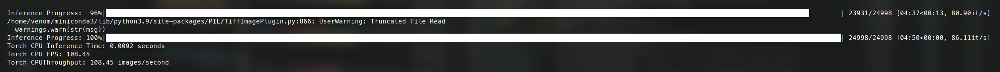
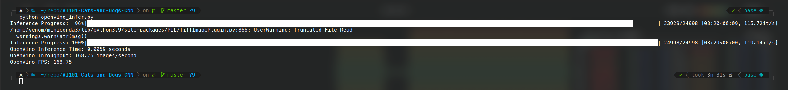

# AI101 - Cats and Dogs Classification

This project implements a cats and dogs classification model using PyTorch Lightning. The model is trained on a dataset of images containing cats and dogs. It provides an easy-to-use pipeline for training the model, exporting it to PyTorch and OpenVINO formats, and performing inference using both frameworks.

## Lightning Training Pipeline

The training pipeline utilizes the PyTorch Lightning framework to streamline the training process. It provides a high-level interface for defining the model, handling the training loop, and managing the training configuration. The code is organized using the LightningModule structure, which promotes modularity and code reusability.

## Inference Comparison: PyTorch vs. OpenVINO

To evaluate the performance of the cats and dogs classification model, inference was conducted using both PyTorch and OpenVINO frameworks. The model was loaded and tested on a set of sample images, and the results were compared in terms of inference time and accuracy.

### PyTorch Inference

Here is an example screenshot of the cats and dogs classification model running inference using PyTorch:

### OpenVINO Inference

Here is an example screenshot of the cats and dogs classification model running inference using OpenVINO:

## Dependencies

The project has the following dependencies:

- Python 3.x
- PyTorch
- PyTorch Lightning
- OpenVINO

## License

This project is licensed under the [MIT License](LICENSE).
